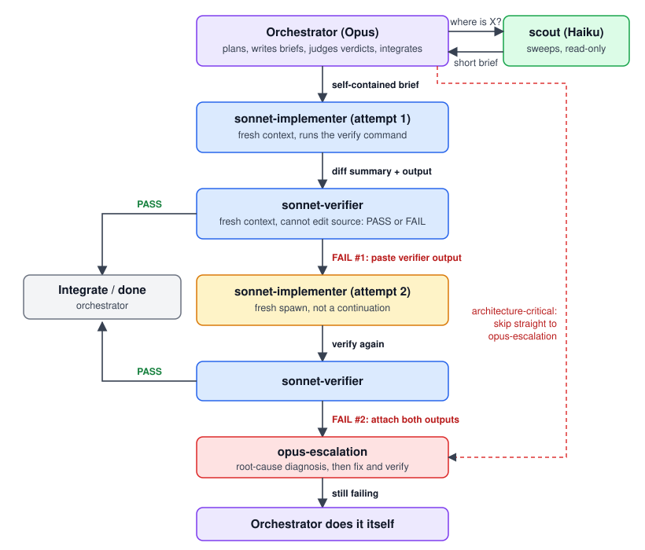

# Architecture

This kit is a convention (agent definitions plus a CLAUDE.md section) with two small hooks that enforce part of it. It does not wrap or modify Claude Code. Everything here is plain Markdown, JSON and Python files that Claude Code already knows how to load.

## The routing ladder



```
                         +--------------------------------------+       +------------------+
                         |  ORCHESTRATOR (Opus, main session)   | ----> | scout (Haiku)    |
                         |  plans, briefs, judges, integrates   | <---- | read-only sweeps |
                         +------------------+-------------------+       +------------------+
                                            |  self-contained brief
                                            v
                         +--------------------------------------+
                         |  sonnet-implementer (attempt 1)      |
                         +------------------+-------------------+
                                            |  diff summary + verification output
                                            v
                         +--------------------------------------+
        PASS  <--------- |  sonnet-verifier (cannot edit)       |
          |              +------------------+-------------------+
          |                                 |  FAIL #1 (paste verifier output into new brief)
          |                                 v
          |              +--------------------------------------+
          |              |  sonnet-implementer (attempt 2)      |  fresh spawn
          |              +------------------+-------------------+
          |                                 v
          |              +--------------------------------------+
        PASS  <--------- |  sonnet-verifier                     |
                         +------------------+-------------------+
                                            |  FAIL #2 (attach both failure outputs)
                                            v
                         +--------------------------------------+
                         |  opus-escalation                     |  <--- architecture-critical
                         +------------------+-------------------+       tasks start here
                                            |  still failing
                                            v
                         +--------------------------------------+
                         |  ORCHESTRATOR does it itself         |
                         +--------------------------------------+
```

### Roles

| Tier | Agent | Model (frontmatter) | Job |
|------|-------|---------------------|-----|
| Plan / judge | the main session | whatever you launch it with | Plans, writes briefs, reads verdicts, integrates. Does not write bulk code. |
| Sweep | `scout` | `claude-haiku-4-5-20251001` | Read-only search across many files. Returns a short brief with `file:line` citations. Tools limited to Read, Grep, Glob. |
| Implement | `sonnet-implementer` | `claude-sonnet-5-5` | Executes a brief. Runs the verification command. Returns diff summary plus real output. |
| Verify | `sonnet-verifier` | `claude-sonnet-5-5` | Runs the checks, reports `VERDICT: PASS` or `FAIL` with evidence. `Edit`, `Write` and `NotebookEdit` are disallowed. |
| Escalate | `opus-escalation` | `claude-opus-5-5` | Root-cause diagnosis after two verifier failures, or for work flagged architecture-critical. |

The `model:` values are copied from the author's own setup. Change them to whatever model IDs your account can use; the structure does not depend on specific models, only on the cheap-sweep / mid-tier-worker / strong-escalation split.

## Why separate contexts

A subagent starts with an empty context and its context is discarded when it returns. The main session's context is re-sent every turn, so anything read there is paid for on every later turn. The design follows from that:

- Reading and bulk editing happen in subagents. Only a compressed result comes back.
- The verifier is a different context from the implementer. The agent that wrote the code does not grade it, so it cannot talk itself into a pass.
- A retry is a fresh spawn, not a continuation, so the new attempt is not anchored on the failed one. The failure information it needs is pasted into the new brief.

I have not measured the savings and make no numerical claim about them. The mechanism (context re-sent per turn) is how the API works; the magnitude depends on your session.

## Brief format

Workers cannot see the conversation, so a brief must stand alone. Each one contains:

1. Objective, in a sentence or two.
2. Absolute paths of every file involved.
3. Files to read first.
4. Decisions already made (so the worker does not reopen them).
5. Acceptance criteria, phrased so each can be checked pass/fail.
6. What not to touch.
7. The exact verification command.
8. The return format: diff summary plus the tail of real verification output, no file dumps.

A brief missing the verification command is the most common cause of a worker returning "done" with nothing to back it up.

## Parallel vs sequential

- Independent tasks go out in one message so they run concurrently. 3 to 5 at a time is a practical ceiling: beyond that the orchestrator spends more effort reconciling than it saves.
- Two tasks that edit the same file run one after another, as do tasks where one needs the other's output.
- When several parallel implementations come back, one verifier checks them together, rather than one verifier per task.

## Verifier as independent review

The verifier is the review step. It runs the named checks, captures real output, and returns a verdict on its first line. Rules built into its agent file:

- A check that could not execute counts as FAIL, with the reason.
- It cannot modify source (tool-level restriction plus an instruction not to write source through Bash).
- It checks wiring: new symbols need live call sites.

Only a verifier FAIL counts as a failure for routing purposes. An implementer saying "I think it's broken" does not advance the ladder; a verdict does.

This is not a substitute for a human review or a security review of risky changes. It checks the acceptance criteria you wrote, which is only as good as those criteria.

## Failure path

1. Verifier FAIL #1: spawn the same worker type again, fresh, with the verifier output pasted verbatim into the brief.
2. Verifier FAIL #2 on the same task: spawn `opus-escalation` with both failure outputs.
3. If escalation also fails: the orchestrator does the task itself.
4. Never a third attempt with the same worker. If it failed twice, the brief or the approach is the problem.
5. Work known up front to be architecture-critical skips to step 2.

The ladder lives in the CLAUDE.md snippet as instructions to the model. Nothing in the hooks counts failures or forces this sequence; that is model behavior, guided by the text.

## Hooks

Both hooks are plain Python (standard library only), read one JSON object from stdin, and exit 0 on any unexpected error.

### `orchestrator_guard.py` (PreToolUse)

Registered for `Read|Bash|Edit|Write|Agent|Task|Workflow`. Claude Code includes `agent_id` in the payload only when the call comes from inside a subagent, which is how the hook tells the two apart without any other state.

| Situation | Result |
|-----------|--------|
| Call from a subagent (`agent_id` present) | Allowed, unrestricted |
| Main thread `Read` of a file over `ORCH_KIT_MAX_READ_BYTES` (default 25000), no `limit` | Denied, with advice to use `scout` or add a `limit` |
| Main thread `Read` with `limit`, or of a small or missing file | Allowed |
| Main thread `Bash` starting with `cat`/`head`/`tail`/`type`/`less`/`more`/`bat`/`gc`/`Get-Content` and containing no `\|` | Denied |
| Main thread `Edit` / `Write` | Allowed with a visible `systemMessage` nudge to delegate |
| Main thread `Edit` / `Write` past `ORCH_KIT_MAX_MAIN_EDITS` in one session (if set > 0) | Denied |
| Spawn requesting a model matching `ORCH_KIT_DENY_MODELS` (if set) | Denied, even from a subagent |
| `ORCH_KIT_GUARD=off` or `ORCH_KIT_NATIVE=1` | Read/Bash/Edit rules disabled (the model denylist is not) |

Known limits, so you are not surprised:

- The Bash check is a prefix heuristic. `cat file > out`, `grep -r . /` or `python -c "print(open(...).read())"` are not caught. It stops the common accidental dump, nothing more.
- The Read check looks at file size, not at how many tokens the file is. A 24 KB minified file passes.
- Hook behavior depends on the payload fields your Claude Code version sends. `agent_id` is documented for PreToolUse; if your version omits it, the hook will treat subagent calls as main thread and may block them. Test with your own version before relying on it.

### `agent_usage_log.py` (PostToolUse, matcher `Agent`)

Appends one JSON line per finished subagent to `<ORCH_KIT_LOG_DIR>/usage/<session_id>.jsonl`, with: timestamp, agent id, `subagent_type`, `resolvedModel`, token counts, total tokens, duration, and `est_usd`.

Its purpose is to make routing visible: if `sonnet-implementer` shows up as a model you did not intend, or no subagent lines appear in a session that did real work, the orchestrator is not delegating the way you think.

`est_usd` is `null` unless you set `ORCH_KIT_PRICES`. No price table is shipped, because prices change and a stale table would silently produce wrong numbers.

### Where things are written

| What | Path |
|------|------|
| Usage ledger | `<ORCH_KIT_LOG_DIR>/usage/<session_id>.jsonl` |
| Guard deny/warn events | `<ORCH_KIT_LOG_DIR>/guard_events.jsonl` |
| Per-session main-thread edit counter | `<ORCH_KIT_STATE_DIR>/<session_id>.edits` |

Defaults are `~/.claude/orchestration-kit/logs` and `~/.claude/orchestration-kit/state`. Session ids are reduced to `[A-Za-z0-9_.-]` before being used in a file name.

## Things this kit does not do

- It does not select models for you. Models come from agent frontmatter and from how you launch the main session.
- It does not count failures or enforce the retry/escalation order; that is in the instructions.
- It does not make claims about cost or quality improvements. Use the usage ledger on your own sessions to see what happens.
